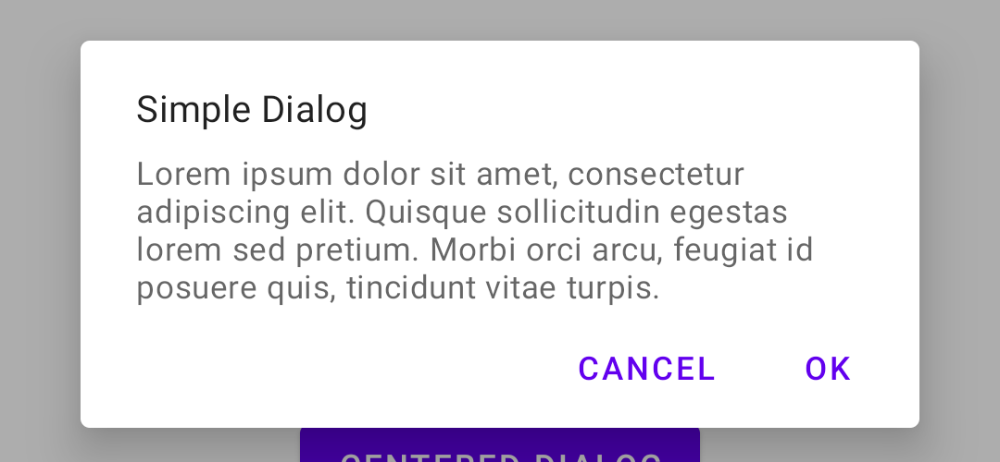
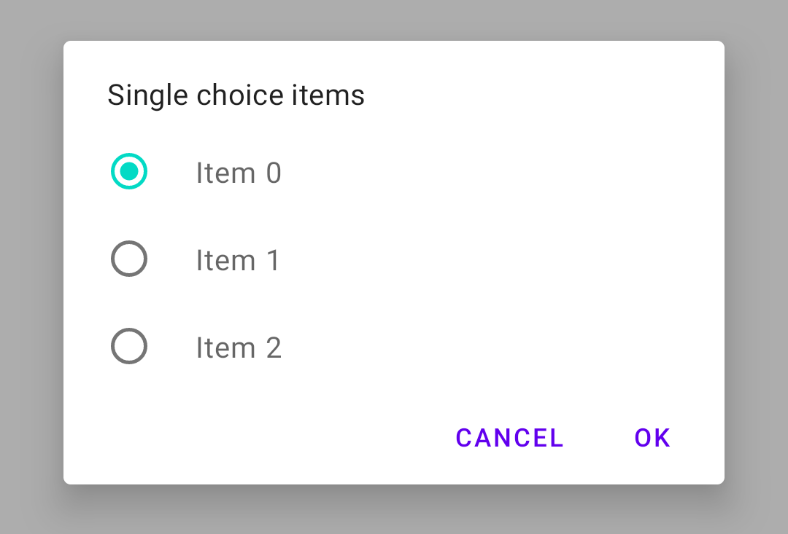
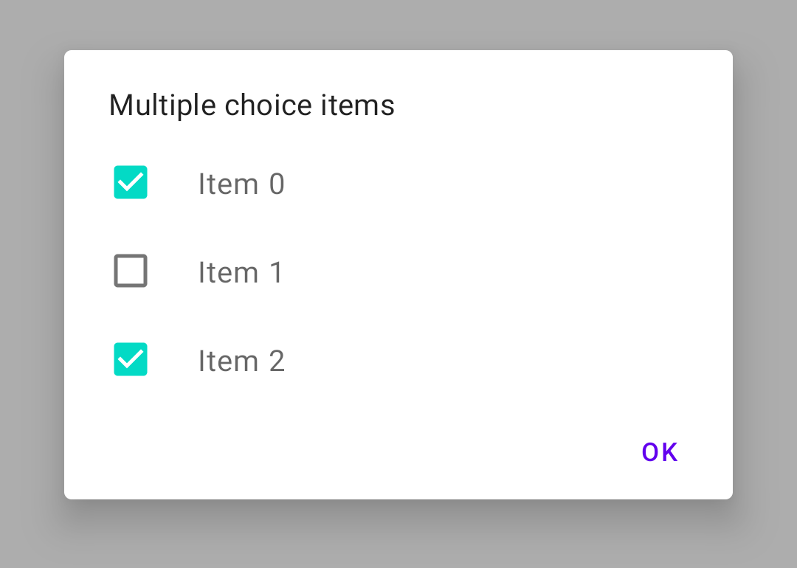
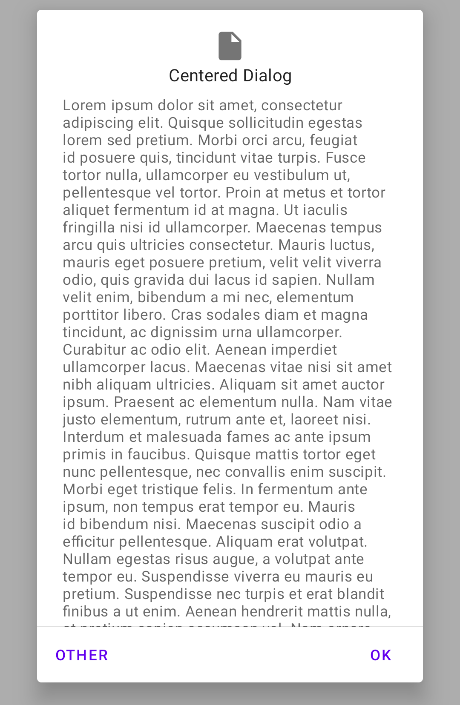

# Companion

A collection of Android extensions and utilities.

```gradle
implementation "dev.sergiobelda.android.companion:companion:0.1.0"
```

## Dialogs



```kotlin
createMaterialDialog(this) {
    title(R.string.simple_dialog)
    message(R.string.lorem_ipsum_short)
    positiveButton(R.string.ok) {
        Toast.makeText(
            this@DialogsActivity,
            "Positive button click",
            Toast.LENGTH_SHORT
        ).show()
    }
    negativeButton("Cancel")
}.show()
```



```kotlin
createMaterialDialog(this) {
    title(R.string.single_choice_items)
    singleChoiceItems(R.array.items, checkedItem = 0) {
        Toast.makeText(this@DialogsActivity, "Selected: $it", Toast.LENGTH_SHORT).show()
    }
    positiveButton(R.string.ok)
    negativeButton(R.string.cancel)
}.show()
```



```kotlin
val items = arrayOf<CharSequence>("Item 0", "Item 1", "Item 2")
val booleanArray = booleanArrayOf(true, false, true)
createMaterialDialog(this) {
    isCancelable = false
    title(R.string.multiple_choice_items_dialog)
    multipleChoiceItems(items, booleanArray) { item, isChecked ->
        booleanArray[item] = isChecked
        Toast.makeText(this@DialogsActivity, "Item $item: $isChecked", Toast.LENGTH_SHORT).show()
    }
    positiveButton(R.string.ok) {
        Toast.makeText(this@DialogsActivity, booleanArray.joinToString(), Toast.LENGTH_SHORT).show()
    }
}.show()
```



```kotlin
createMaterialDialog(
    this,
    R.style.ThemeOverlay_MaterialComponents_MaterialAlertDialog_Centered
) {
    icon(R.drawable.ic_baseline_file_24)
    title(R.string.centered_dialog)
    message(R.string.lorem_ipsum_long)
    positiveButton(R.string.ok)
    neutralButton(R.string.other)
}.show()
```

## Extensions

## Util

## License

```
Copyright 2021 Sergio Belda

Licensed under the Apache License, Version 2.0 (the "License");
you may not use this file except in compliance with the License.
You may obtain a copy of the License at

    http://www.apache.org/licenses/LICENSE-2.0

Unless required by applicable law or agreed to in writing, software
distributed under the License is distributed on an "AS IS" BASIS,
WITHOUT WARRANTIES OR CONDITIONS OF ANY KIND, either express or implied.
See the License for the specific language governing permissions and
limitations under the License.
```
